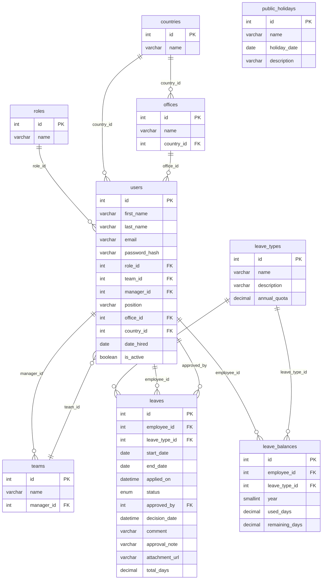

```mermaid
erDiagram
    roles {
        int id PK
        varchar name
    }
    countries {
        int id PK
        varchar name
    }
    offices {
        int id PK
        varchar name
        int country_id FK
    }
    teams {
        int id PK
        varchar name
        int manager_id FK
    }
    leave_types {
        int id PK
        varchar name
        varchar description
        decimal annual_quota
    }
    users {
        int id PK
        varchar first_name
        varchar last_name
        varchar email
        varchar password_hash
        int role_id FK
        int team_id FK
        int manager_id FK
        varchar position
        int office_id FK
        int country_id FK
        date date_hired
        boolean is_active
    }
    leaves {
        int id PK
        int employee_id FK
        int leave_type_id FK
        date start_date
        date end_date
        datetime applied_on
        enum status
        int approved_by FK
        datetime decision_date
        varchar comment
        varchar approval_note
        varchar attachment_url
        decimal total_days
    }
    leave_balances {
        int id PK
        int employee_id FK
        int leave_type_id FK
        smallint year
        decimal used_days
        decimal remaining_days
    }
    public_holidays {
        int id PK
        varchar name
        date holiday_date
        varchar description
    }


    roles ||--o{ users               : "role_id"
    countries ||--o{ offices          : "country_id"
    countries ||--o{ users            : "country_id"
    offices ||--o{ users              : "office_id"
    teams ||--o{ users                : "team_id"
    users ||--o{ teams                : "manager_id"
    leave_types ||--o{ leaves         : "leave_type_id"
    users ||--o{ leaves               : "employee_id"
    users ||--o{ leaves               : "approved_by"
    users ||--o{ leave_balances       : "employee_id"
    leave_types ||--o{ leave_balances  : "leave_type_id"
```
